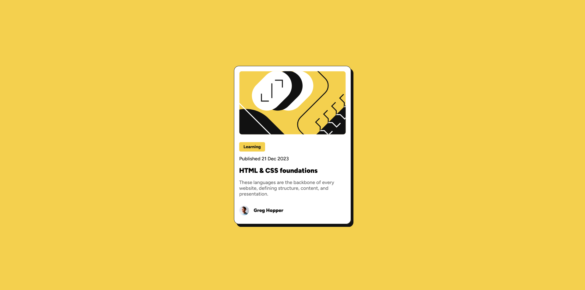

# Frontend Mentor - Blog preview card solution

This is a solution to the [Blog preview card challenge on Frontend Mentor](https://www.frontendmentor.io/challenges/blog-preview-card-ckPaj01IcS). Frontend Mentor challenges help you improve your coding skills by building realistic projects.

## Table of contents

- [Overview](#overview)
  - [Screenshot](#screenshot)
  - [Links](#links)
- [My process](#my-process)
  - [Built with](#built-with)
  - [What I learned](#what-i-learned)
  - [Continued development](#continued-development)
  - [AI Collaboration](#ai-collaboration)
- [Author](#author)

## Overview

### Screenshot

### Links

- Solution URL: [github.com/lmnot343guiltyspark/preview-card-front-end-mentor](https://github.com/lmnot343guiltyspark/preview-card-front-end-mentor)
- Live Site URL: [imnot343guiltyspark.github.io/preview-card-front-end-mentor](https://imnot343guiltyspark.github.io/preview-card-front-end-mentor/)

## My process

### Built with

- Semantic HTML5 markup
- CSS custom properties
- Flexbox
- `@font-face` with a local variable font
- Media queries for a mobile-first responsive layout
- `:hover` and `:focus` pseudo-classes for interactive states

### What I learned

For this challenge I learned more about semantic HTML, using new tags like `<time>`. Where I made the most progress was in CSS — I learned how to load typography a different way, figured out how to apply hover and focus at the same time, and used `:root` for my colors as a good coding practice.

I also learned that padding can't help you with everything. I understood that margin is useful in situations where other tools might fail, and that even `gap` isn't for everything — it works well for specific boxes using flex, but in general, if you want specific spacing, you have to look at and understand what each tool actually does. Patience is still your best ally.

### Continued development

CSS layout and spacing — it's essential to understand how each tool works. Everything can be achieved, but understanding is the foundation of it all.

### AI Collaboration

I worked hand-in-hand with Claude without it giving me the answers — it guided me, but it never gave me a single line of code to solve my problems.

## Author

- Frontend Mentor - [@Rickgaav](https://www.frontendmentor.io/profile/Rickgaav)
